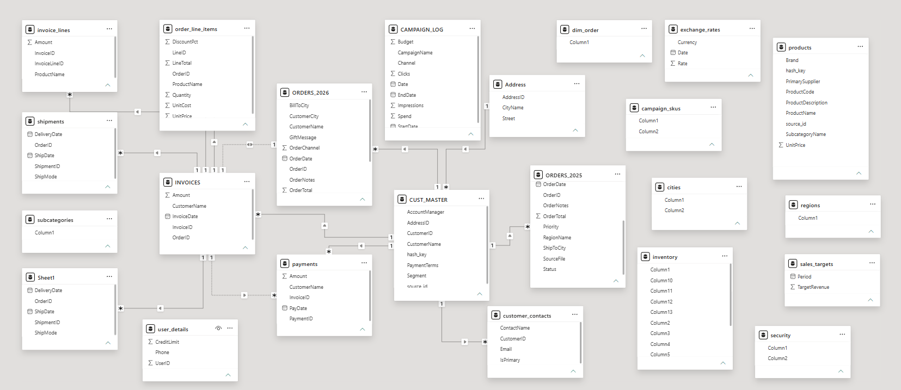
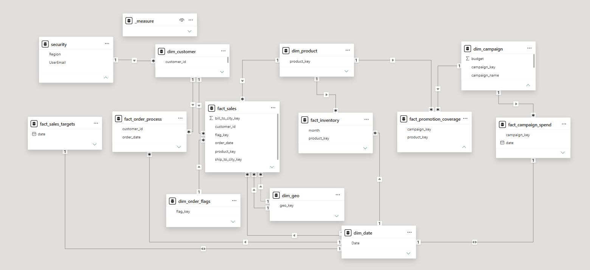

# Star Schema Modeling for Sales, Inventory & Marketing Analytics — DAX Measures & Row-Level Security

Redesigning a fragmented, undocumented sales dataset into a multi-fact star schema (sales, inventory, marketing) with DAX measures and row-level security.

## Problem

The source data arrived as a set of disconnected, undocumented tables rather than an analytics-ready model:

- Order data split across yearly tables (`ORDERS_2025`, `ORDERS_2026`) instead of one unified fact table
- Undocumented columns (`Column1`, `Column2`, ...) in several core tables (`inventory`, `security`, `sales_targets`, `cities`, `regions`)
- Redundant / overlapping entities: invoice, order, and payment data spread across multiple tables (`invoices`, `invoice_lines`, `order_line_items`, `payments`) with no clear ownership
- No consistent relationship structure between customer, product, and geography tables

## Solution

The dataset was restructured into a star schema built for analysis:

- **6 fact tables** covering distinct business processes: `fact_sales`, `fact_inventory`, `fact_promotion_coverage`, `fact_campaign_spend`, `fact_sales_targets`, `fact_order_process`
- **Conformed dimensions** (`dim_date`, `dim_customer`, `dim_product`, `dim_geo`, `dim_campaign`) shared consistently across fact tables
- **Junk dimension** (`dim_order_flags`) to consolidate low-cardinality flags/categories without bloating the fact tables
- **DAX measures** built on top of the model for sales, inventory, and campaign analysis
- **Row-level security** via the `security` table, filtering data access by `Region` / `UserEmail`

## Scope

This repo focuses on the data model itself — schema design, relationships, DAX measures, and row-level security. It does not include a dashboard/report layer.

## Tools

- Power BI (Power Query, Data Modeling view, DAX)
